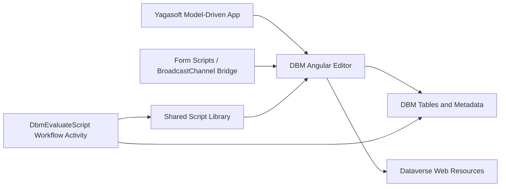

# Current-State Baseline

This document records the official revival baseline for DBM as it exists today in source and in the published PoC materials.

## Baseline sources

- active source branch: `main`
- reference-only branch: `feature/script-lib/main`
- current published repo framing: [README.md](../../README.md)
- reviewed solution package: `DynamicsBusinessMachine_0_1_1_1.zip`
- supporting external materials: architecture and roadmap visuals in `D:\Drive\Work (1)\DBM`

## What exists today

DBM is currently a Dataverse-centric PoC foundation composed of:

- an Angular editor application hosted as Dataverse web resources
- Dataverse form integration scripts that bridge the editor into DBM forms
- a shared JavaScript runtime/library intended to support cross-tier execution
- a Dataverse custom workflow activity that evaluates scripts on the server using Jint
- a Yagasoft model-driven app entry that exposes the DBM editor

## Strongest implemented assets

- The editor shell already exists and is usable enough to manage DBM resources.
- The backend evaluator proves server-side execution through the DBM scripting concept.
- The shared runtime establishes the core "write once, run everywhere" direction.
- The packaged solution proves that the idea was shipped publicly as a real PoC.

## Key repo areas

- `dbm-app`
  - the current editor and resource-management experience
- `dbm-web-resources`
  - model-driven form integration and Dataverse helper code
- `dbm-script-lib`
  - shared runtime, entity abstraction, service abstraction, and helper surfaces
- `dbm-js-vm`
  - browser-side library loader and execution wrapper
- `DbmSolution`
  - Dataverse plugin/workflow project and XrmToolBox host project

## What is partial or incomplete

- the browser-side VM/runtime surface is incomplete
- richer Dataverse request mapping is unfinished
- FetchXML editing is only a placeholder
- JSON modeling stops short of a full business-process model
- the XrmToolBox host exists in source but is not yet a product-grade delivery surface
- source/build drift is present and needs early cleanup

## What does not exist yet

- a true process-first designer
- a real PCF-based in-form process runtime
- full portal-to-backend-to-portal lifecycle support
- Dataverse-first work-management and service-plane implementation
- production-grade packaging, promotion, rollback, and release governance
- AI-assisted analysis and authoring

## Baseline implications

- We are reviving a strong seed, not finishing a nearly complete platform.
- Release 0 must harden engineering, docs, delivery, and environments before we scale feature work.
- Release 1 must convert the current resource-centric PoC into a process-centric builder platform.
- Future planning should reuse the proven concepts, but not preserve every PoC implementation choice.
