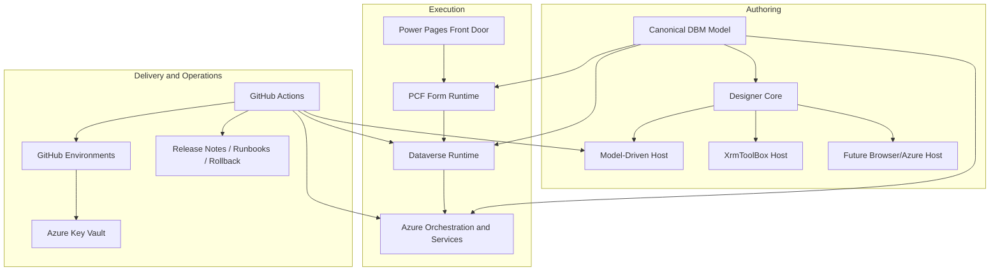

# Target Platform Architecture

This document defines the intended high-level architecture for DBM. It describes the enduring platform shape that the release plan is designed to deliver incrementally.

## Architectural intent

DBM should let a solution architect or developer define, deploy, run, and support an end-to-end business process from a single designer-led experience.

The platform must support:

- process flow definition
- form definition
- metadata and structure definition
- business rules and branching
- execution across client, Dataverse, and Azure
- pipeline-driven deployment and promotion
- future AI-assisted design and validation

## Core platform boundaries

### 1. Canonical DBM model

The product needs one authoritative model that describes:

- process stages and transitions
- forms and UI layout
- metadata and schema-related definitions
- validation and business rules
- executable logic contracts
- deployment packaging metadata

This model is the heart of portability and runtime consistency.

### 2. Designer core

The designer core owns editing behavior, validation, model composition, and serialization. It should be host-agnostic.

### 3. Host adapters

The designer is hosted through adapters, not duplicated implementations.

- Release 1 host: model-driven experience
- Release 1 portable host: XrmToolBox
- later hosts: browser/Azure-hosted administration or management surfaces

### 4. Execution runtimes

The same platform contract should support several execution contexts:

- PCF runtime on model-driven forms
- Dataverse backend execution
- Azure orchestration and service-plane execution

### 5. Delivery and operations layer

The platform must include:

- GitHub Actions pipelines
- GitHub Environments
- Azure Key Vault integration
- Dataverse solution promotion
- Azure artifact promotion
- release evidence, smoke tests, and rollback procedures

## Target platform view

## Release mapping

- Release 0 establishes delivery, governance, environments, and baseline recovery.
- Release 1 delivers the canonical model, designer core, host adapters, backend runtime, and real PCF runtime for one approval/request scenario.
- Release 2 completes the end-to-end loop through Power Pages and Azure, then hardens the solution to pilot-ready `v1.0.0`.
- Release 3 adds AI only after platform contracts and operations are reliable.

## Architecture constraints

- The designer must remain the primary interaction surface.
- No secret may live in source control.
- No release may bypass Dev and UAT promotion.
- Release 1 must not use a temporary web-resource substitute for the in-form runtime.
- Azure should complement Dataverse, not copy responsibilities unnecessarily.
