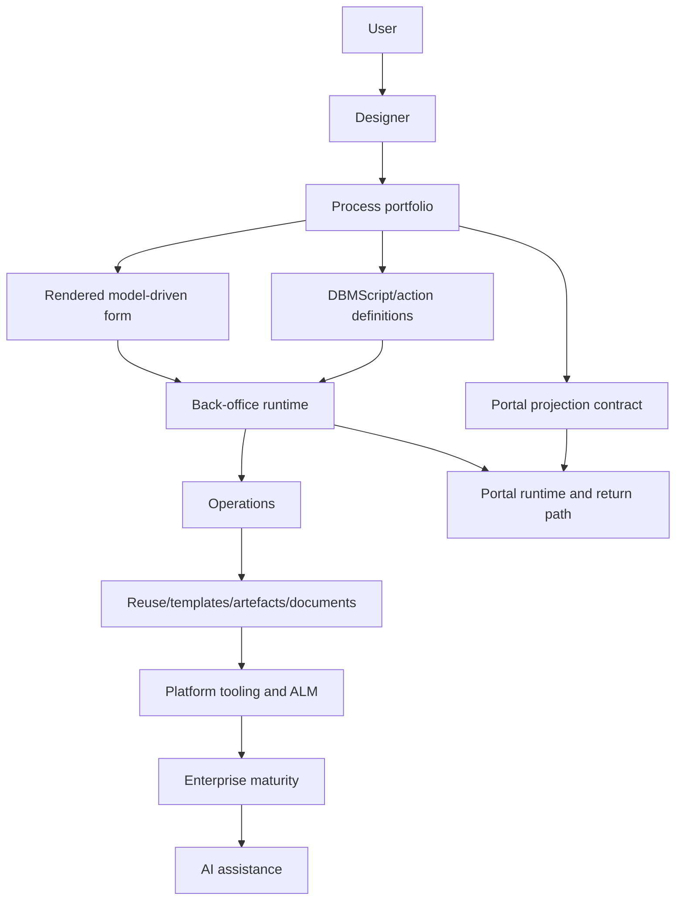

# Target platform architecture

This document defines the target architecture for DBM after the process-first roadmap reset.

## Architectural intent

DBM should let a user design a complete business cycle from portal to back office and back to the portal again.

The product is centred on a process portfolio:

- one root process that drives the full lifecycle
- reusable child process definitions under any stage
- stage-owned child process links with blocked/awaiting-child semantics
- a rendered form experience for business users
- a portal-safe projection for portal users
- JavaScript-first action logic through DBMScript
- Dataverse/model-driven back-office runtime before portal runtime

## Core boundaries

### 1. Process portfolio

The process portfolio is the authoritative product model. It owns `mainProcessId`, `processes[]`, `subProcessVisibility`, `childProcessRefs[]`, stage feature hooks, status, portal status, and process-to-form rendering semantics.

### 2. Designer core

The designer core owns validation, editing behaviour, serialization, and model composition. It must stay host-agnostic and must not depend on a specific graph library save format.

### 3. Rendered form experience

The rendered form is the business-user surface. It is distinct from the designer. In `R1`, DBM must prove actual model-driven form render of the parent process context and active child process surface.

### 4. Portal projection

Portal projection is a view of canonical process state. `R1` defines the contract only. Actual portal rendering and runtime continuity arrive in `R5`.

### 5. DBMScript/action runtime

DBMScript is the JavaScript-first action substrate. It owns scripts, actions, templates, dependencies, output handling, trace behaviour, and execution planning across browser, model-driven, and Dataverse/Jint contexts.

### 6. Back-office runtime

The back-office runtime owns process instances, child process spawning, parent-stage locking, child completion, stage transitions, status persistence, form behaviour, owner/user/role scope, and action trigger execution in model-driven/Dataverse contexts.

### 7. Operations layer

The operations layer owns routing, tasks, notifications, SLA/KPI, validations, history, jobs, custom messages, and support surfaces.

### 8. Reuse and artefacts

Reusable templates, sub-processes, table row templates, artefacts, documents, cloning, service definitions, and numbering deepen the product after runtime basics are stable.

### 9. Platform tooling and ALM

DBM Manager, source sync, XrmToolBox playground, DBM Solution packaging, versioning, DBM Tree, enhanced jobs, post-deploy scripts, and automation make DBM manageable as a platform.

### 10. Enterprise maturity and AI

Simulation, replay, explainability, governance, drift control, observability, and optimisation arrive before AI. AI is layered on top only after DBM works well without AI.

## Target platform view

## Release mapping

- `R0` keeps engineering and governance foundations.
- `R1` proves the process portfolio designer and actual model-driven rendered form.
- `R2` proves DBMScript and JavaScript-first actions.
- `R3` proves back-office runtime.
- `R4` adds operations.
- `R5` adds portal runtime and return path.
- `R6` adds reuse, templates, artefacts, and documents.
- `R7` adds platform tooling and ALM.
- `R8` adds enterprise maturity.
- `R9` adds AI assistance.

## Architecture constraints

- The designer remains the primary authoring surface.
- The rendered form is not the designer.
- The root process is always visible on rendered form and portal projection surfaces.
- Child processes render under the parent stage that owns them and can be conditional.
- Stage-owned child process links are semantic, not merely visual.
- DBMScript starts with JavaScript first.
- Actual portal runtime starts after back-office runtime.
- Current implementation is reference material unless it fits the reset architecture and passes current tests.
