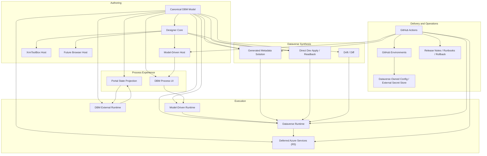

# Target Platform Architecture

This document defines the intended high-level architecture for DBM. It describes the enduring platform shape that the release plan is designed to deliver incrementally.

## Architectural intent

DBM should let a solution architect or developer define, deploy, run, and support one business process that spans the external front door to backend and back again from a single designer-led experience.

The platform must support:

- stage, step, and form-state definition
- graph-first designer authoring and preview
- coherent process UI across model-driven and external surfaces
- metadata, columns, and generated Dataverse form authoring
- reusable conditions, branching, and status projection
- execution across external runtime, client, and Dataverse, with Azure deferred for exceptional non-Dataverse needs
- pipeline-driven deployment and promotion
- future AI-assisted design and validation

## Core platform boundaries

### 1. Canonical DBM model

The product needs one authoritative model that describes:

- process stages, steps, branching, and convergence
- form definitions and form-state variations
- portal-visible state projection versus internal runtime state
- metadata, schema-related definitions, and generated Dataverse artifacts
- reusable conditions, validation, and executable logic contracts
- deployment packaging metadata

This model is the heart of portability and runtime consistency.

### 2. Designer workspace sidecar

The long-term designer also needs a non-authoritative UI-state sidecar so the product can be graph-first without polluting the canonical model.

That sidecar owns:

- canvas node positioning
- viewport and zoom state
- collapsed groups and panel state
- preview-mode preferences
- other UI-only authoring state that must not become canonical business semantics

### 3. Designer graph interchange boundary

Graph-capable shells also need one DBM-owned graph/interchange contract that is independent of any chosen renderer or authoring library.

That contract owns:

- stable DBM graph node, edge, group, and port identifiers
- semantic references back to canonical stage, step, outcome, and transition identifiers
- a portable graph shape that can be mapped to multiple designer libraries without changing package persistence

That contract does not own:

- canonical process semantics
- library-native renderer state
- persisted authoring state that is required to recover business behavior

The chosen graph library must sit behind adapters that consume this DBM-owned graph contract rather than becoming the save/load format.

### 4. Designer core

The designer core owns editing behavior, validation, model composition, semantic checks, serialization, and synthesis planning. It should remain host-agnostic.

### 5. Process experience layer

DBM owns the business-process experience itself. That experience must remain coherent across model-driven and external surfaces even when some internal stages or steps are intentionally hidden from external users.

The process experience should be driven through one derived UI read model built from canonical model plus runtime state. That keeps renderers consistent without making the renderer contract the system of record.

For model-driven forms:

- the preferred target is a process experience rendered at the top of the form, above tabs
- supported platform placement should be preferred whenever it can satisfy the UX goal
- if no supported placement can achieve the required UX in the near term, a simplified unsupported placement method may be used with explicit documentation and explicit fallback to the supported host

Native Dataverse business process flow is not the source of truth. It may be generated later as an optional integration artifact where it adds value.

### 6. Host adapters

The designer is hosted through adapters, not duplicated implementations.

- first proof host: model-driven experience
- first portable host: XrmToolBox
- later hosts: browser-hosted administration and management surfaces

The host shell is replaceable. The canonical model, designer graph interchange contract, and designer core are the enduring seams.

### 7. Execution runtimes

The same platform contract should support several execution contexts:

- DBM-owned model-driven runtime
- DBM-owned external runtime and state projection
- Dataverse backend execution
- deferred Azure execution only for `R5` responsibilities that Dataverse cannot reasonably own

### 8. Delivery and operations layer

The platform must include:

- GitHub Actions pipelines
- GitHub Environments
- Dataverse-owned operational configuration and platform-owned secret posture where feasible
- Dataverse solution promotion
- deferred Azure artifact promotion only for approved `R5` Azure components
- release evidence, smoke tests, and rollback procedures

### 9. Dataverse synthesis layer

DBM needs a dedicated Dataverse synthesis layer between the canonical model and Dataverse delivery artifacts.

That layer owns:

- direct metadata apply and readback in `Dev`
- tracked emitted source for the layered generated-metadata solution
- drift detection between the canonical model, emitted artifacts, and live Dataverse metadata
- later generated FormXML and same-table behavior artifacts

Raw solution XML remains an emitted artifact family, not the primary authoring surface.

## Capability layers

Beyond the core `R1` synthesis boundary, DBM can grow through explicit capability layers that deepen the platform without changing the canonical model's role as source of truth.

### Simulation and replay

- process simulation before deployment
- replay and branch debugging for runtime instances
- support-facing inspection of what happened and why

### Explainability

- why a condition matched
- why a status, assignment, or visibility rule resolved the way it did
- why a synthesis change was proposed

### Synthesis and drift control

- preview-before-apply synthesis plans
- diffs for generated Dataverse forms and columns
- drift detection between designer intent, tracked artifacts, and environment state

### Work management and operational control

- inboxes, queues, reassignment, delegation, escalation, and SLA timers
- support and administration surfaces
- operational controls tied back to canonical process semantics

### Audit timeline and runtime observability

- timeline of process decisions and transitions
- audit trail of status, assignment, notification, and mutation events
- runtime telemetry, diagnostics, and performance insight

### Reuse and policy

- reusable conditions
- reusable step groups, subflows, templates, and policy packs
- organization-level consistency without copy-paste modeling

### AI assistance

- requirement-to-process drafting
- logic and condition suggestion
- missing-step and missing-data analysis
- test-scenario generation
- optimization guidance

AI is layered on top of the stable platform. It does not replace the canonical model, runtime, or governance boundaries.

## Target platform view

## Release mapping

- Release 0 establishes delivery, governance, environments, and baseline recovery.
- Release 1 locks the canonical process semantics, designer core, Dataverse synthesis layer, host adapters, and the first DBM-owned model-driven runtime for one approval/request scenario.
- Release 1 also defines the portal-facing process projection contract, but it does not deliver the live external runtime.
- Release 2 productizes the designer shell, the shared process-experience system, the model-driven placement strategy, and the portal-continuity UX foundation without yet delivering the live external runtime.
- Release 3 delivers the real DBM-owned external runtime, beginning with the local SPA proof, plus Dataverse-first external continuity, work-management, timeline, observability baselines, and pilot-ready hardening.
- Release 4 adds AI drafting, review, gap detection, and optimization only after platform contracts and operations are reliable.
- Release 5 adds Azure-backed services only where Dataverse cannot reasonably own the required runtime, integration, telemetry, or operational responsibility.
- Release 6 deepens enterprise sophistication through simulation, replay, reusable building blocks, synthesis governance, and advanced analytics and optimization.

## Architecture constraints

- The designer must remain the primary interaction surface.
- DBM owns the process UI. Native BPF is optional integration, not the product boundary.
- Preview-before-mutate applies to generated artifacts and other authoritative platform mutations.
- No secret may live in source control.
- No release may bypass Dev and UAT promotion.
- Release 1 must not use a temporary web-resource substitute as the final process runtime boundary.
- Azure is deferred to R5 for capabilities that Dataverse cannot reasonably own.
